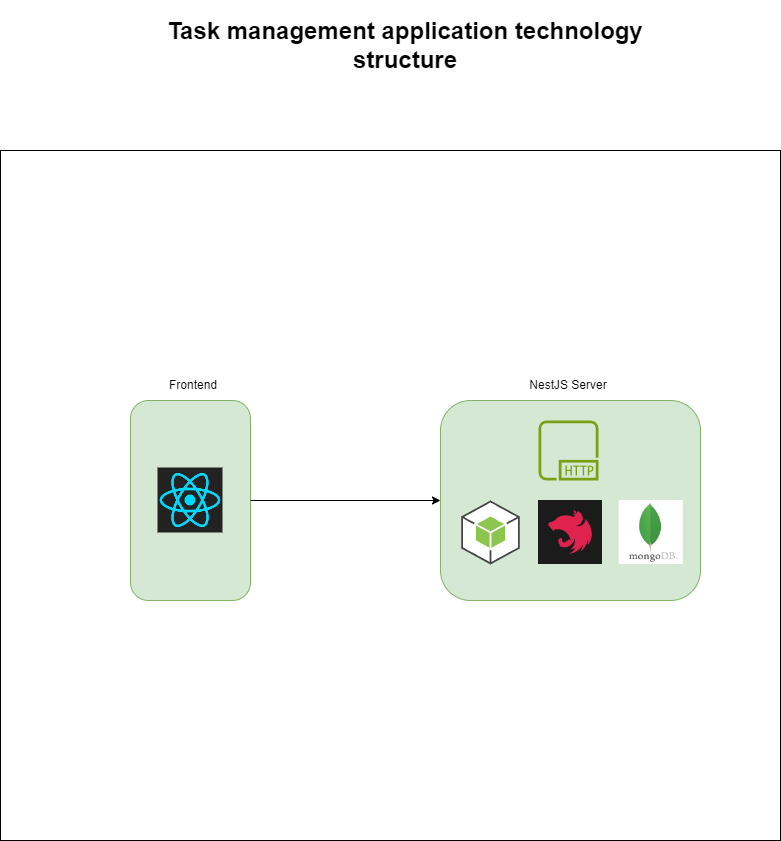
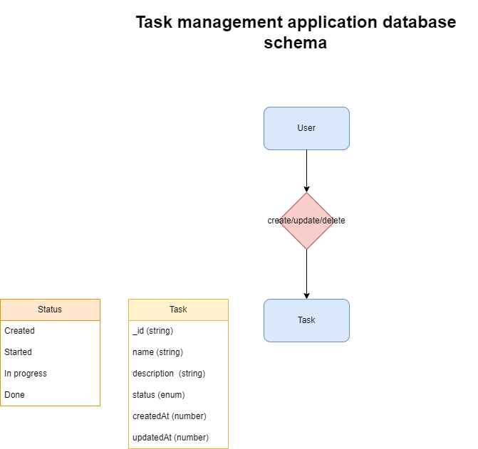

# Task Management App
[](https://skillicons.dev)

This application is to manage and track tasks. 


## Run
Please make sure to create `.env` files with the appropriate environment variable
### Local
1. Install & run the backend for frontend:
    ```bash
    cd task-management-bff
    cp .env.example .env
    npm install
    npm run start
    ```
2. Install & run the frontend:
    ```bash
    cd task-management-client
    cp .env.example .env
    npm install
    npm start
    ```
### Docker
- Run using docker if available:
    ```bash
    docker-compose -f docker-compose.yaml up --build # watch log
    docker-compose -f docker-compose.yaml up -d # run in background
    ```

After running both services navigate to http://localhost:3000. 

<b>P.S Make sure that both `3000` & `3001` ports are not used. In case these ports are used, change environment variable `PORT` in `.env` file.</b>

## [API Documentation](http://localhost:3001/api/swagger)
Check swagger documentation for api endpoints and schemas http://localhost:3001/api/swagger

## Design
<p style="display:flex;max-width: 40%;">
  
  
</p>

## Roadmap
- Design application flow and RestAPI schema
- RestAPI Endpoints
- Design interface
- React Interface

## Tools used

- NestJS
- MongogDB
- React JS
- TypeScript
- Redux Toolkit
- React Router DOM
- HTML

## TODO
None

## version
- 1.0